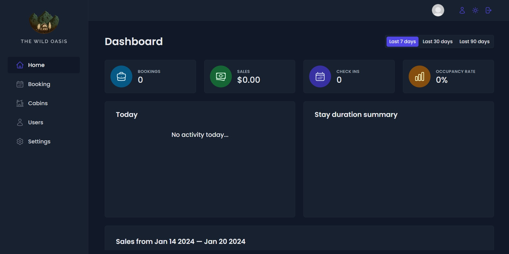
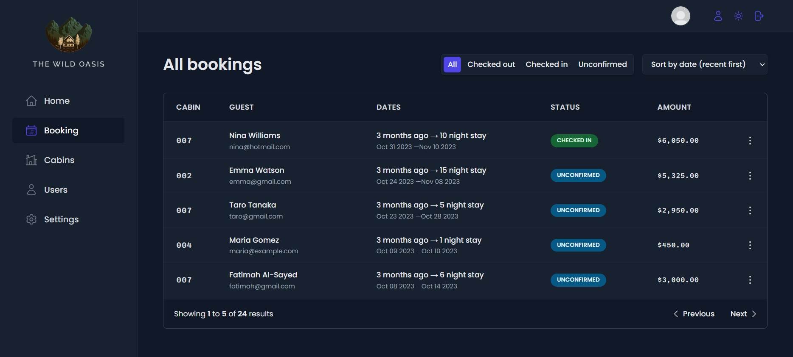

#The Wild Oasis

##About the project

This is project from The Ultimate React Course 2024: React, Redux & More by Jonas Schmedtmann - https://www.udemy.com/course/the-ultimate-react-course/

The project is a simulation of a hotel operating application, allows you to add new cabins, service guests, includes charts and statistics of specific dates. The project includes login, user management and database made with the help of Supabase.

###Dashboard


###Bookings


###Cabins management


###User settings


##Build with

[](https://reactjs.org/) - React Query, React Router, Recharts, React hook form and more libs.
[](https://styled-components.com/)
[](https://supabase.io/)

##How to run
Supabase shuts down the database after 2 weeks of inactivity so the project will probably not function properly.

1. Clone the repo
```git clone https://github.com/JudiJudi6/the-wild-oasis.git```

2. Install NPM packages
```npm i```

3. To run app
```npm run dev```
